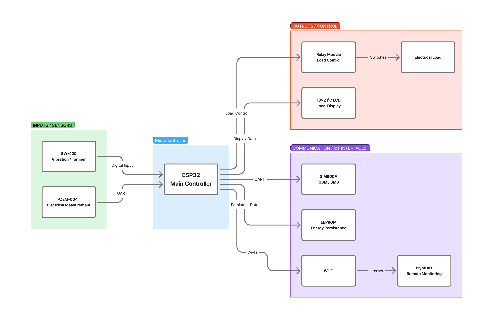
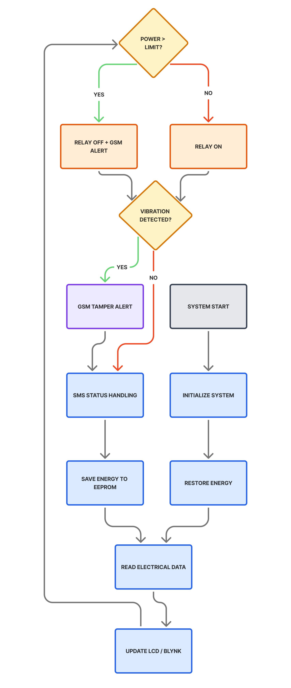
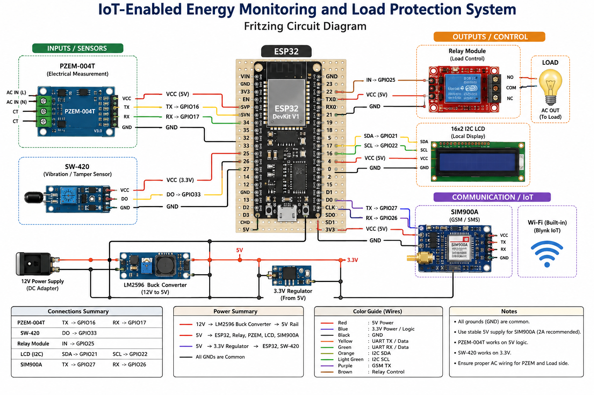
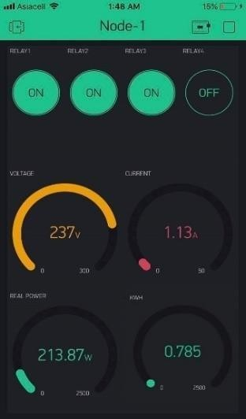
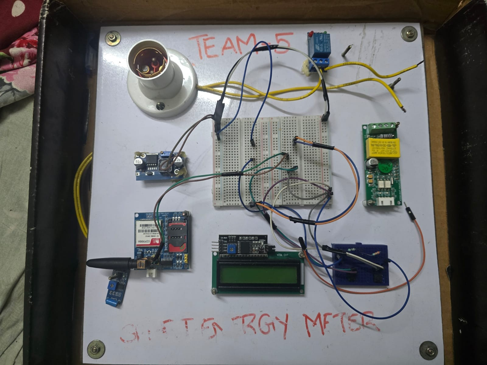
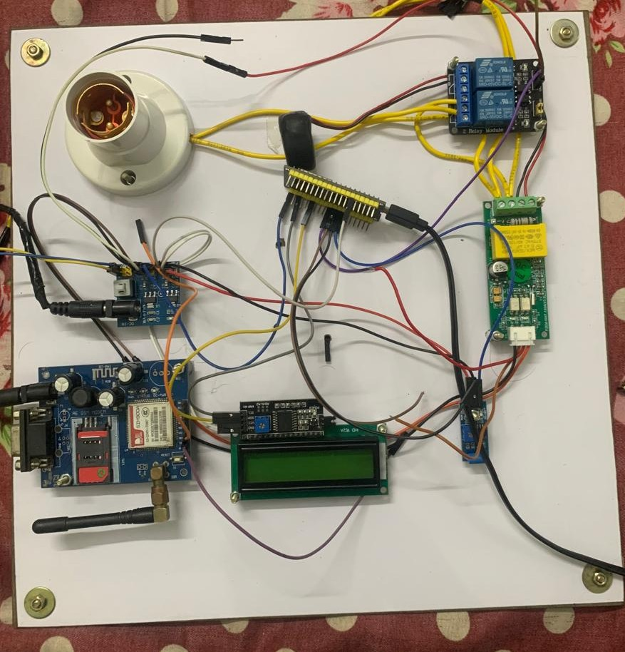

# IoT-Enabled Energy Monitoring and Load Protection System

An ESP32-based IoT system for real-time electrical energy monitoring, remote visualization, automated load protection, and tamper detection. The system integrates the PZEM-004T energy measurement module, Blynk IoT, SIM900A GSM communication, relay-based load control, SW-420 vibration sensing, and EEPROM-backed energy data persistence.

## Overview

This project presents a connected embedded system designed to monitor electrical parameters and provide automated protection for a connected electrical load.

An **ESP32** acts as the central controller and integrates electrical measurement, local display, IoT monitoring, GSM communication, tamper detection, relay-based load control, and persistent energy storage.

The system monitors:

- Voltage
- Current
- Real power
- Cumulative energy
- Frequency
- Power factor

When measured power exceeds a configured operating limit, the system can disconnect the load through a relay and generate an SMS alert. The system also monitors vibration-based tamper events and provides remote visibility through Blynk IoT.

---

## Key Features

- ESP32-based embedded control
- Real-time electrical parameter monitoring
- Voltage, current, power, energy, frequency, and power-factor measurement
- PZEM-004T electrical measurement
- Blynk IoT remote monitoring
- GSM/SMS communication using SIM900A
- Configurable power-limit protection
- Automatic relay-based load disconnection during overload
- Vibration-based tamper detection
- Local monitoring through a 16×2 I2C LCD
- SMS-based system interaction
- EEPROM-backed cumulative energy storage
- Wi-Fi connectivity and reconnection handling

---

## System Architecture

The system is organized into four functional groups:

1. **Input and Measurement**
   - PZEM-004T electrical measurement
   - SW-420 vibration/tamper detection

2. **Embedded Controller**
   - ESP32 DevKit V1
   - Measurement processing
   - Protection logic
   - Communication handling
   - Data persistence

3. **Output and Load Control**
   - Relay module
   - 16×2 I2C LCD
   - Connected electrical load

4. **Communication and IoT**
   - SIM900A GSM/SMS communication
   - ESP32 Wi-Fi
   - Blynk IoT
   - EEPROM-based data storage

### Architecture Diagram



---

## System Workflow

During startup, the ESP32 initializes the connected sensors, communication interfaces, LCD, relay, and persistent storage before entering the monitoring loop.

The main operating sequence is:

1. Initialize the ESP32 and connected peripherals.
2. Establish Wi-Fi and Blynk connectivity.
3. Initialize the PZEM-004T measurement interface.
4. Initialize the SIM900A GSM interface.
5. Restore stored energy data when available.
6. Read electrical parameters periodically.
7. Compare measured power with the configured limit.
8. Update the relay state according to the protection condition.
9. Monitor the SW-420 for vibration or tamper events.
10. Update the local LCD.
11. Send system and measurement data to Blynk IoT.
12. Generate GSM/SMS notifications for configured events.
13. Periodically store cumulative energy data.
14. Monitor and recover Wi-Fi connectivity when required.

### Flowchart



---

## Hardware Components

| Component | Function |
|---|---|
| ESP32 DevKit V1 | Main controller |
| PZEM-004T v3.0 | Voltage, current, power, energy, frequency and power-factor measurement |
| SIM900A | GSM/SMS communication |
| SW-420 | Vibration and tamper detection |
| Relay Module | Electrical load switching and protection control |
| 16×2 I2C LCD | Local display |
| LM2596 Buck Converter | 12 V to 5 V power conversion |
| 3.3 V Regulator | Low-voltage peripheral supply |
| 12 V DC Supply | System power source |

---

## Circuit and Pin Configuration

The major peripheral connections used in the prototype are:

| Device | Signal | ESP32 GPIO | Interface |
|---|---|---:|---|
| PZEM-004T | TX | GPIO 16 | UART2 RX |
| PZEM-004T | RX | GPIO 17 | UART2 TX |
| SIM900A | TX | GPIO 27 | UART1 RX |
| SIM900A | RX | GPIO 26 | UART1 TX |
| Relay | Control | GPIO 25 | Digital Output |
| SW-420 | DO | GPIO 33 | Digital Input |
| LCD | SDA | GPIO 21 | I2C |
| LCD | SCL | GPIO 22 | I2C |

### Circuit Diagram



The hardware wiring should be checked against the circuit diagram before assembling or modifying the prototype.

---

## Electrical Measurement

The **PZEM-004T** provides the electrical parameters used by the controller:

- Voltage
- Current
- Real power
- Cumulative energy
- Frequency
- Power factor

The ESP32 periodically reads these values and uses them for local display, IoT monitoring, protection logic, and persistent energy storage.

---

## Load Protection

The system uses a configurable power threshold for load protection.

The protection flow is:

```text
Measured Power > Configured Limit
                ↓
         Overload Detected
                ↓
       Relay Disconnection
                ↓
        GSM/SMS Notification
```

When the measured power exceeds the configured threshold, the ESP32 can:

1. Detect the overload condition.
2. Disconnect the connected load through the relay.
3. Generate an overload notification.
4. Report the system status through the connected interfaces.

---

## Tamper Detection

An **SW-420 vibration sensor** is used to detect vibration or possible physical tampering.

When a vibration event is detected:

1. The ESP32 identifies the event.
2. A debounce mechanism helps prevent repeated triggers from a single event.
3. The tamper state is activated.
4. A GSM/SMS notification can be generated.
5. The local display can indicate the tamper condition.

---

## IoT Monitoring

The ESP32 uses its built-in Wi-Fi capability to communicate with the **Blynk IoT** platform.

The Blynk dashboard provides remote visualization of the measured electrical parameters and system state.

### Blynk IoT Dashboard



### Blynk Data Mapping

| Virtual Pin | Parameter |
|---|---|
| V0 | Voltage |
| V1 | Current |
| V2 | Power |
| V3 | Energy |
| V4 | System Operating Value |
| V5 | Frequency |
| V6 | Power Factor |
| V7 | Relay State |

---

## GSM Communication

The **SIM900A** provides GSM-based SMS communication.

The firmware supports notifications for configured system conditions, including:

- Overload detection
- Tamper detection
- System status

The SIM900A communicates with the ESP32 through a dedicated UART interface.

The firmware also supports SMS-based system interaction.

---

## Local Display

A **16×2 I2C LCD** provides local monitoring of electrical parameters and system status.

The display can present:

- Voltage
- Current
- Power
- Energy
- Frequency
- Power factor
- Relay state
- System status

Priority conditions such as overload and tamper events can take precedence over normal display pages.

---

## Energy Data Persistence

The ESP32 uses EEPROM emulation to retain important operating data, including cumulative energy information.

Stored data is periodically updated and restored during initialization when a valid stored record is available.

This allows retained operating information to survive system restart or power interruption.

---

## Firmware

The firmware is written for the **ESP32 using the Arduino framework**.

The implementation is organized around functions for:

- Electrical measurement
- Load control
- LCD display handling
- GSM communication
- Blynk IoT updates
- EEPROM storage
- Wi-Fi recovery
- Tamper detection

The firmware uses timer-based scheduling within the main loop to service multiple subsystems.

---


## Prototype Hardware

The implemented prototype integrates the ESP32 controller, measurement and communication modules, relay interface, LCD, power circuitry, vibration sensor, and connected electrical load.

### Prototype 1



### Prototype 2



---

## Software Requirements

- Arduino IDE
- ESP32 board support package

### Libraries

- WiFi
- EEPROM
- Wire
- LiquidCrystal_I2C
- PZEM004Tv30
- BlynkSimpleEsp32
- HardwareSerial

---

## Hardware Requirements

- ESP32 DevKit V1
- PZEM-004T v3.0
- SIM900A GSM module
- SW-420 vibration sensor
- Relay module
- 16×2 I2C LCD
- LM2596 buck converter
- 3.3 V regulator
- 12 V DC power supply
- Appropriate electrical wiring and load

---

## Setup

### 1. Clone the Repository

```bash
git clone https://github.com/noorul23/iot-energy-monitoring-load-protection.git
cd iot-energy-monitoring-load-protection
```

### 2. Open the Firmware

Open the firmware source in Arduino IDE.

### 3. Install ESP32 Support

Install the ESP32 board support package through the Arduino IDE Board Manager.

### 4. Install Required Libraries

Install the libraries listed in the Software Requirements section.

### 5. Configure Credentials

Before uploading the firmware, configure the required:

- Wi-Fi SSID
- Wi-Fi password
- Blynk Template ID
- Blynk Template Name
- Blynk authentication token
- Authorized phone number

Do not commit real credentials, passwords, tokens, or private contact information.

### 6. Verify Hardware Connections

Verify the GPIO assignments and hardware connections using the pin configuration table and circuit diagram in this README.

### 7. Upload Firmware

Select the appropriate ESP32 board and COM port and upload the firmware.

### 8. Monitor Serial Output

Use the Arduino Serial Monitor at:

```text
115200 baud
```

to observe system initialization, measurements, connectivity, GSM communication, and system events.

---

## Project Outcomes

The prototype demonstrates the integration of:

- Electrical measurement
- Embedded firmware
- UART communication
- I2C communication
- GSM communication
- Wi-Fi connectivity
- IoT monitoring
- Automated relay control
- Tamper detection
- Local display
- Persistent energy storage

The project demonstrates an ESP32-centered architecture for connected electrical monitoring and automated load protection.

---

## Limitations

This project is a **prototype implementation** and should not be treated as a certified electrical protection device or commercial energy meter.

The prototype involves electrical load connections and therefore requires appropriate electrical isolation, protection circuitry, enclosure design, grounding, and safety validation before practical deployment.

The project was developed primarily to demonstrate the embedded monitoring, communication, control, and protection architecture.

---

## Future Improvements

Potential improvements include:

- Dedicated PCB implementation
- Improved electrical isolation and protection
- Enclosed hardware design
- Historical energy-consumption logging
- Advanced energy-consumption analytics
- Configurable protection thresholds through the IoT interface
- Improved GSM fault handling
- Additional electrical safety monitoring
- Production-oriented hardware validation
- More compact hardware integration

---

## Repository Structure

```text
iot-energy-monitoring-load-protection/
│
├── README.md
├── LICENSE
│
├── firmware/
│   └── energy_monitoring_system.ino
│
├── hardware/
│   ├── system_architecture.jpg
│   ├── system_flowchart.jpg
│   └── circuit_diagram.png
│
├── images/
│   ├── blynk_dashboard.png
│   ├── prototype_01.jpg
│   └── prototype_02.jpg
│
└── docs/
    └── technical_report.pdf
```

---

## Documentation

The detailed technical project report contains the system architecture, system flow, hardware design, circuit and pin configuration, firmware logic, output, prototype documentation, and conclusion.

---

## Project Author

**Noorul Hassan**

Embedded Systems | IoT | Firmware | Hardware Integration

[GitHub Profile](https://github.com/noorul23)

---

## License

This project is licensed under the MIT License.

See the [LICENSE](./LICENSE) file for details.
